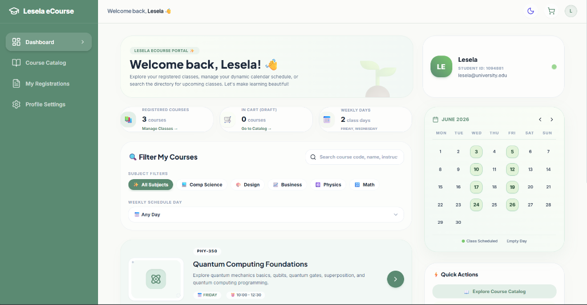

<div align="center">

```
╔═══════════════════════════════════════════════════════════╗
║           STUDENT REGISTRATION PORTAL                     ║
║           A full-stack academic management system         ║
╚═══════════════════════════════════════════════════════════╝
```

[](https://openjdk.org/)
[](https://spring.io/projects/spring-boot)
[](https://react.dev/)
[](https://www.typescriptlang.org/)
[](https://tailwindcss.com/)
[](LICENSE)

<br/>



</div>

---

## What This Is

A production-grade, full-stack web application for managing student course registrations. It handles the full lifecycle — from browsing a course catalog, to detecting scheduling conflicts in real time, to managing enrollments through a protected admin panel.

Built without a framework scaffold. Every design decision was intentional.

---

## The Problem It Solves

University registration systems are notoriously bad. Slow, confusing, and prone to errors like double-booking a student into overlapping courses. This project addresses that directly:

- Students can browse courses, add them to a cart, and register — all in one flow.
- The system detects **time conflicts** before they happen, using an interval-overlap algorithm on the server.
- Admins have a dedicated panel to view and manage all registrations.
- Sessions are stateless — JWT tokens are issued at login and verified on every request.

---

## Architecture

```
┌─────────────────────┐        REST / JSON        ┌──────────────────────────┐
│                     │  ─────────────────────►   │                          │
│   React 19 + Vite   │                           │  Spring Boot 3 (Java 21) │
│   TypeScript        │  ◄─────────────────────   │  Stateless JWT Auth      │
│   Tailwind CSS      │        HTTP 200 / 4xx      │  H2 In-Memory Database   │
│   TanStack Query    │                           │  JPA / Hibernate ORM     │
│                     │                           │                          │
└─────────────────────┘                           └──────────────────────────┘
         │                                                    │
    Port 5173                                            Port 8080
```

**Conflict detection formula:**

```
Conflicts if:  Max(Start_A, Start_B)  <  Min(End_A, End_B)
```

This single check is run server-side on every registration request. If it triggers, the request is rejected before any database write occurs.

---

## Project Structure

```
student-registration-portal/
│
├── backend/                        # Spring Boot application
│   ├── src/main/java/com/saas/portal/
│   │   ├── controller/             # REST endpoints (Auth, Course, Registration)
│   │   ├── service/                # Business logic and conflict detection
│   │   ├── model/                  # JPA entities (Student, Course, Registration)
│   │   ├── repository/             # Spring Data JPA repositories
│   │   ├── security/               # JWT filter, token util, security config
│   │   └── dto/                    # Request/Response transfer objects
│   └── src/main/resources/
│       └── application.properties  # DB config, JWT secret, CORS
│
└── frontend/                       # React + Vite application
    └── src/
        ├── components/
        │   ├── auth/               # Login, Register forms
        │   ├── layout/             # Navbar, Sidebar, Shell
        │   └── registration/       # CartDrawer, CourseCard
        ├── pages/                  # Dashboard, Catalog, Management
        ├── context/                # CartContext (global registration state)
        ├── hooks/                  # useAuth, useCart, useRegistrations
        ├── api/                    # Axios client + typed API calls
        └── types/                  # Shared TypeScript interfaces
```

---

## Getting Started

### Prerequisites

| Tool | Version |
|------|---------|
| Java | 21+ |
| Node.js | 18+ |
| Maven | 3.8+ |

---

### Backend

```bash
cd backend
mvn clean package -DskipTests
java -jar target/portal-0.0.1-SNAPSHOT.jar
```

The API will be available at `http://localhost:8080`.

The H2 console (for inspecting the in-memory database) is available at:
`http://localhost:8080/h2-console`

Use `jdbc:h2:mem:student_registration` as the JDBC URL.

---

### Frontend

```bash
cd frontend
npm install
npm run dev
```

The app will be available at `http://localhost:5173`.

---

### Default Credentials

The database seeds two accounts on startup:

| Role | Username | Password |
|------|----------|----------|
| Admin | `admin` | `admin123` |
| Student | `student` | `student123` |

---

## Key Features

**For Students**
- Browse the full course catalog with schedule details
- Add courses to a cart before committing
- Conflict detection prevents overlapping schedules
- View all current registrations from the dashboard
- Drop courses individually

**For Admins**
- View all student registrations across the system
- Remove any registration
- Access the H2 console for direct DB inspection

**System**
- JWT authentication — no sessions stored server-side
- CORS configured for local development
- Clean error messages returned as JSON
- All state managed with TanStack Query (no Redux)

---

## API Reference

| Method | Endpoint | Auth | Description |
|--------|----------|------|-------------|
| `POST` | `/api/auth/login` | None | Returns JWT token |
| `POST` | `/api/auth/register` | None | Creates a student account |
| `GET` | `/api/courses` | JWT | List all courses |
| `POST` | `/api/registrations` | JWT | Register for a course |
| `GET` | `/api/registrations/my` | JWT | Get current student's registrations |
| `DELETE` | `/api/registrations/{id}` | JWT | Drop a course |
| `GET` | `/api/registrations/all` | Admin JWT | View all registrations |

