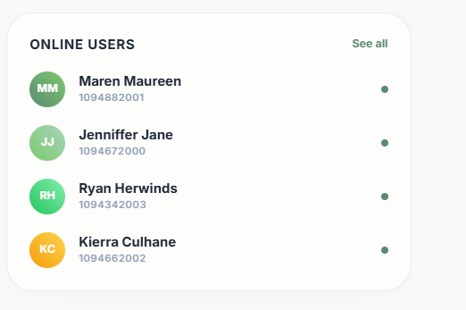
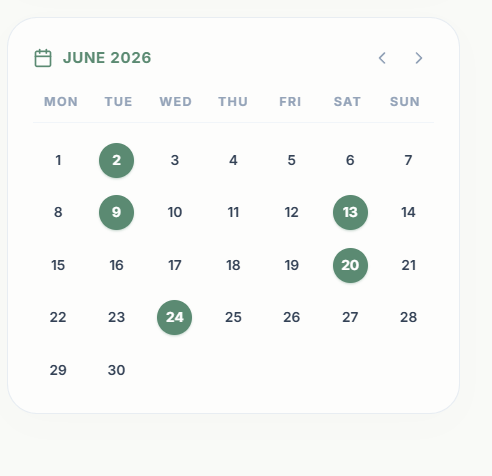

# Lesela eCourse

Lesela eCourse is a modern, responsive course registration system that provides students with an interactive workspace to plan, validate, and manage their semester schedules. The project is split into a Spring Boot backend API and a React frontend client.

---

## Workspace Capabilities

The system handles core registration workflows:
* Multi-facet catalog search by code, name, department, day, and availability.
* Real-time course drafting via an active registration cart.
* Live schedule clash detection to prevent duplicate time-slot bookings.
* Integrated weekly timetable calendar with scheduled class popups.
* Administrative course drop operations and academic history listings.

---

## Architecture and Design Decisions

### Technical Stack
* Backend API: Spring Boot 3 with Java 21, Spring Security (JWT), and H2 Database.
* Frontend Client: React 19, TypeScript, Vite, TanStack React Query, and Framer Motion.

### Stateless Security Model
The backend implements stateless authentication using JSON Web Tokens (JWT). Student credentials are validated against hashed database entries, and a signed token is returned. The client stores this token and sends it in the Authorization header of all subsequent API requests.

### Client-Side Cache Sync
To minimize API requests and ensure instant interface updates, the frontend uses TanStack React Query. Catalog searches, active registrations, and profile changes are automatically cached. Mutation actions trigger targeted cache invalidation, forcing silent background refreshes.

### Calendar Timetable Generation
The dashboard calendar matches student enrollments to dates on a dynamic grid. When a student registers for a course, the calendar filters date matches for the course's designated weekday and maps scheduled sessions into interactive tooltips.

### Schedule Overlap Logic
Schedule overlap checks are performed before both cart additions and final DB commits. If the start and end times of two courses on the same weekday intersect, a conflict warning is shown. The intersection rule is:
`Max(Start_Time_A, Start_Time_B) < Min(End_Time_A, End_Time_B)`

---

## Directory Map

```
student-registration-portal/
├── backend/
│   ├── src/main/java/com/saas/portal/
│   │   ├── config/          # Security filters, database initializers, and seeds
│   │   ├── controller/      # API entry points (Auth, Course, Registration)
│   │   ├── dto/             # Network request/response data shapes
│   │   ├── exception/       # Business error mappings and validation handlers
│   │   ├── mapper/          # Compiled MapStruct translator definitions
│   │   ├── model/           # JPA entities representing database tables
│   │   ├── repository/      # Database queries via Spring Data interfaces
│   │   └── security/        # JWT parsing filters and user authorities
│   ├── src/main/resources/  # H2 properties and application configurations
│   └── pom.xml              # Maven dependency specifications
└── frontend/
    ├── src/
    │   ├── components/      # UI components (buttons, input fields, cart drawer)
    │   ├── context/         # Auth contexts, cart contexts, and toast queues
    │   ├── layouts/         # Collapsible page shells and layouts
    │   ├── pages/           # Views (Login, Dashboard, Catalog, Management)
    │   ├── services/        # Service clients for API communication
    │   ├── types/           # Core TypeScript type definitions
    │   └── utils/           # Utility files
    ├── index.html           # Root entry document
```

---

## User Interface Walkthrough

Below are screenshots of the portal views detailing the layouts and interactive features.

### Student Dashboard Overview

The dashboard serves as the central hub of the portal. It features the student identity card showing name and ID, along with three quick statistics blocks: the count of registered courses, active drafts in the registration cart, and the total weekly course days. Below these controls is the main workspace, which displays either the registered course list or course catalog preview cards depending on current enrollment.


### Dashboard Calendar Interface

The right column of the dashboard contains an interactive calendar. It highlights scheduled class days dynamically by referencing the student's active enrollments and cart items. Hovering over a highlighted date displays a detailed tooltip detailing the courses scheduled for that day.


### Course Directory Catalog

The catalog view allows students to search through the directory. It includes department selectors, keyword search bars, and course availability toggles. Course cards display details such as course code, name, description, scheduled day and time, seat capacity, and action buttons to add or remove courses from the cart.



### Academic Registration Manager

The management page lists all active semester registrations. Students can view details or initiate dropping a course via a drop confirmation modal. The page also displays historical academic courses with completed grades and semesters.



---

## System Requirements and Installation

### Backend Execution
1. Install Java Development Kit (JDK) 21.
2. Navigate to the `/backend` folder.
3. Run the compiled JAR:
   ```bash
   java -jar target/portal-0.0.1-SNAPSHOT.jar
   ```

* Initial Seed Data: On startup, the system seeds 10 sample courses and a student profile.
* Seed Account: `lesela@university.edu` / `password`
* API Console: Swagger documentation is available at `http://localhost:8080/swagger-ui/index.html`
* Database Console: H2 web interface is available at `http://localhost:8080/h2-console` (JDBC URL: `jdbc:h2:mem:student_registration`, username: `sa`, empty password)

### Frontend Execution
1. Install Node.js (version 20 or higher).
2. Navigate to the `/frontend` directory.
3. Install dependencies:
   ```bash
   npm install
   ```
4. Start the development server:
   ```bash
   npm run dev
   ```
5. Access the application in your browser at `http://localhost:5173`.
